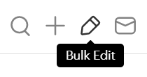

# pocketSelectAll
Add the ability to select all [Pocket](https://app.getpocket.com/) articles. This process can be easily automated using tools like [Integromat](https://www.integromat.com/) but I'll test custom JS scripts for practicing purposes.

If you are familiar with userscripts<a href="u1">[[1]](#1)</a><a href="u2">[[2]](#2)</a>, you can just copy and load it to your favorite manager[[3]](#3) such as [Violentmonkey](https://violentmonkey.github.io/) from this [file](vm_pocketSelectAll.js) or install it directly from [greasyfork](https://greasyfork.org/en/scripts/412592-pocketselectall).

If you just want to try it on your browser you can follow this simple steps:

1. Enable the bulk edit option within Pocket. 
		
2. Copy the `script.js` code and paste it into your browser's console (F12 or Menu -> Dev tools) and press `Enter`.
   
This will show a couple of buttons allowing you to select all visible articles (Pocket currently only shows around 25 at a time) or all articles within the page. 

When using the *Select all* option the script will select all visible articles, scroll down and wait 2 seconds for the new batch to load (showing *working...* within the button) until it finds no more articles to select (showing *done* within the button).

### Notes:
- The *Select all* script has been tested to work properly down to 1mb speeds, if you have a slower connection try raising the interval time at line 63 (`timer` function).
- Instructions for [selecting with Integromat](./integromat.md).
  
### Refs:
1. <a id="1" href="https://en.wikipedia.org/wiki/Userscript">"Userscript". *Wikipedia*.</a>
2. <a id="2" href="https://openuserjs.org/about/Userscript-Beginners-HOWTO">"Userscript beginners how to". *OpenUserJS*.</a>
3. <a id="3" href="https://en.wikipedia.org/wiki/Userscript_manager">"Userscript manager". *Wikipedia*.</a>
