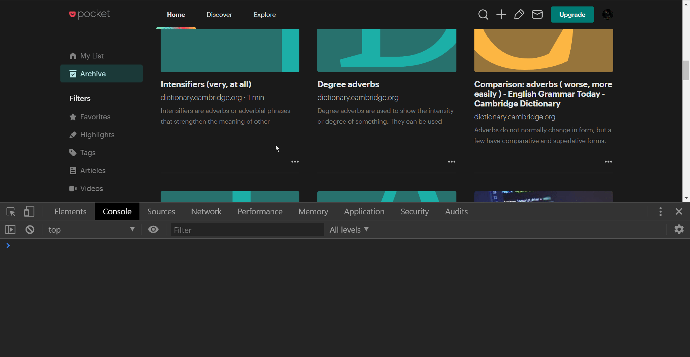

# pocketSelectAll
Add the ability to select all [Pocket](https://app.getpocket.com/) articles. This process can be easily automated using tools like [Integromat](https://www.integromat.com/) but I'll test custom JS scripts for practicing purposes.

Will try to implement a button to use it in the same way but for now you need to copy the `script.js` code and paste it into the console after enabling bulk edit and it will select all visible articles (currently around 25). 

### - Refs:

- Inspired in part by [this Greasy Fork script](https://greasyfork.org/en/scripts/39554-pocket-select-all).
