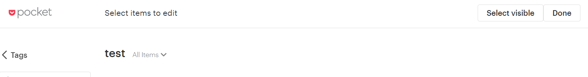

# pocketSelectAll
Add the ability to select all [Pocket](https://app.getpocket.com/) articles. This process can be easily automated using tools like [Integromat](https://www.integromat.com/) but I'll test custom JS scripts for practicing purposes.

I'll implement easier ways to use this but for now you'd need to follow this simple steps:

1. Enable the bulk edit option within Pocket.
		
2. Copy the `script.js` code and paste it into your browser's console (F12 or Menu -> Dev tools) and press `Enter`.
   
This will show a button allowing you to select all visible articles (Pocket currently only shows around 25 at a time). If you want to select more you can scroll down and click the button again.

### - Refs:

- Inspired in part by [this Greasy Fork script](https://greasyfork.org/en/scripts/39554-pocket-select-all).
