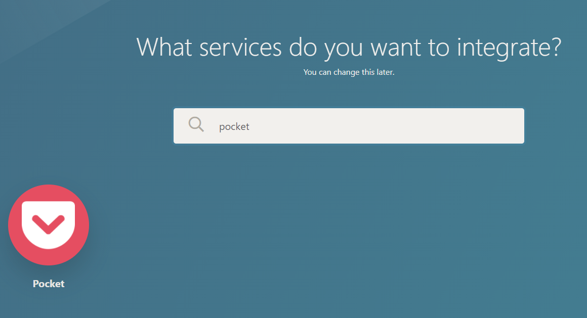
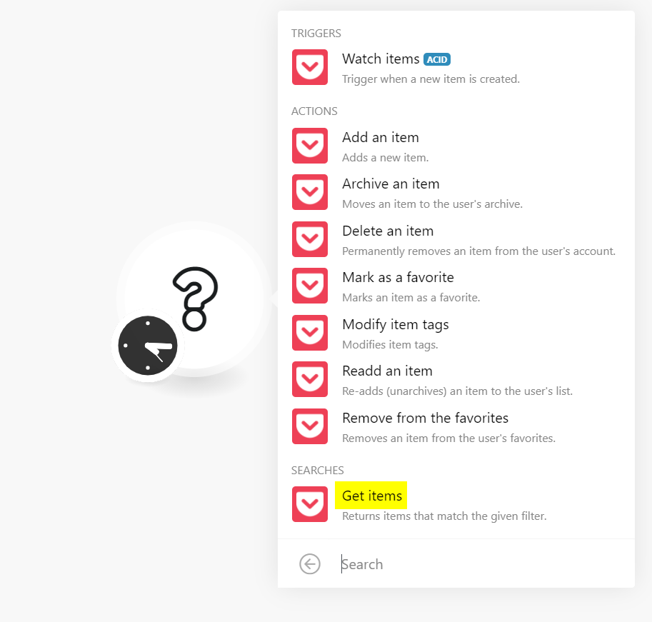
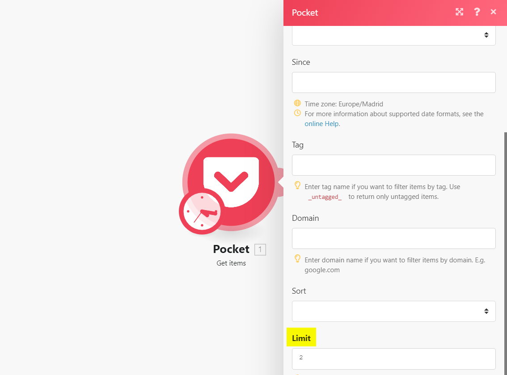
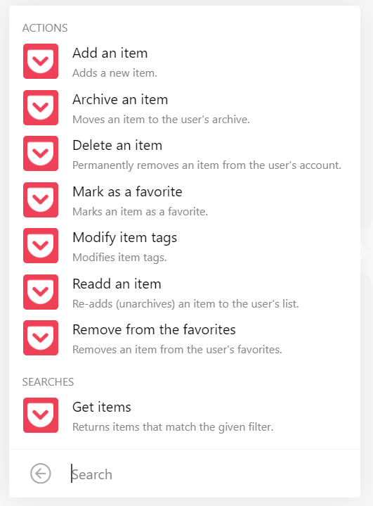
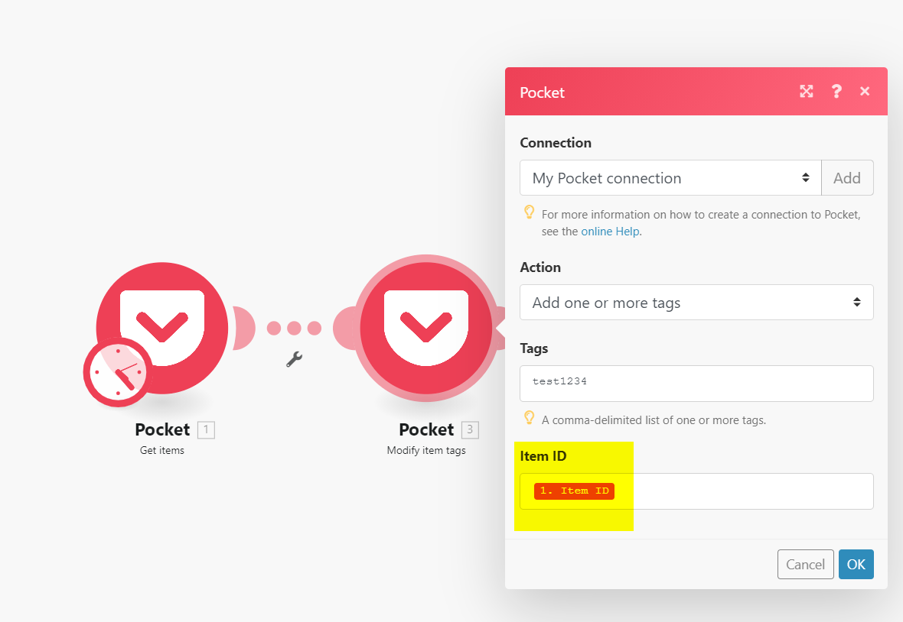

# Processing articles with Integromat

This example describes how to let Integromat manage the process:

1. Create a new scenario using Pocket.
   
2. Add Pocket as 1st step to get items and set the limit.
   
	 
3. Add a module for the action you want to perform on them and set the Item ID field to Item ID
   
	 
This scenario will allow you to perform this action once, on a set schedule or even  on specific events. More on [Integromat's help section](https://support.integromat.com/hc/en-us/categories/360000515213-Getting-Started).